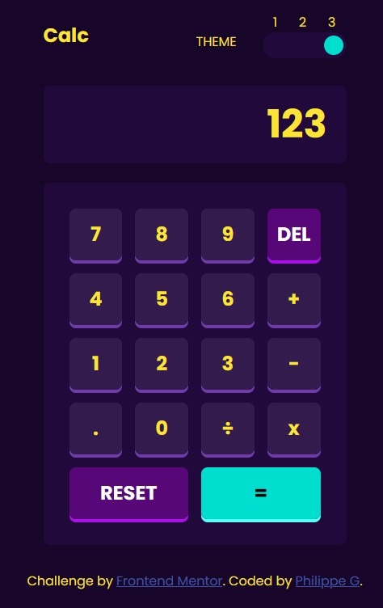

# Frontend Mentor - Calculator app solution

This is a solution to the [Calculator app challenge on Frontend Mentor](https://www.frontendmentor.io/challenges/calculator-app-9lteq5N29). Frontend Mentor challenges help you improve your coding skills by building realistic projects.

## Table of contents

- [Frontend Mentor - Calculator app solution](#frontend-mentor---calculator-app-solution)
	- [Table of contents](#table-of-contents)
	- [Overview](#overview)
		- [The challenge](#the-challenge)
		- [Screenshot](#screenshot)
		- [Links](#links)
	- [My process](#my-process)
		- [Built with](#built-with)
		- [What I learned](#what-i-learned)
		- [Continued development](#continued-development)
	- [Author](#author)
	- [Acknowledgments](#acknowledgments)

**Note: Delete this note and update the table of contents based on what sections you keep.**

## Overview

### The challenge

Users should be able to:

- See the size of the elements adjust based on their device's screen size
- Perform mathmatical operations like addition, subtraction, multiplication, and division
- Adjust the color theme based on their preference
- **Bonus**: Have their initial theme preference checked using `prefers-color-scheme` and have any additional changes saved in the browser

### Screenshot



### Links

- Solution URL: [Frontend Mentor](https://www.frontendmentor.io/solutions/a-calculator-that-remember-your-prefered-theme-SLwbsXG1Rp)
- Live Site URL: [Github Pages](https://z0ul0u25.github.io/FeM-CalculatorWithTheme/)

## My process

### Built with

- Semantic HTML5 markup
- CSS custom properties
- Flexbox
- CSS Grid
- Sass


### What I learned

I've learned how to do custom color theme. Is it the way of the industry? I don't know, I did it the way i thought was good. What I'm sure is that there is a way to optimise this with Sass `mixins`.
I also learned how to deal with numbers with lots of decimals.

Like how to detect if the number is actually to big as a String to be displayed:

```js
	if (result > 0) {
		if (Math.ceil(Math.log10(result)) > 11) {
			needReset = true;
			return "Too Big!";
		}
	}

	if (result.toString().length > 11) {
		let toKeep = 11 - Math.floor(result).toString().length;
		if (toKeep > 0) {
			return result.toFixed(toKeep);
		} else {
			needReset = true;
			return (result < 0) ? "Too Small" : "Too Big!";
		}
	}
```

And a nice bit to remember the theme or set it to the user prefered value:
```js
	if (localStorage.getItem('theme')) {
		setTheme(localStorage.getItem('theme'));
	} else {
		setTheme(window.matchMedia("(prefers-color-scheme: dark)") ? "dark" : "light");
	}
```

### Continued development

I'm sure there is a better way to deal with themes considering accessibility issues and all.

## Author

- Frontend Mentor - [@Z0ul0u25](https://www.frontendmentor.io/profile/Z0ul0u25)


## Acknowledgments

Thanks to my friends who bugtested this app.
